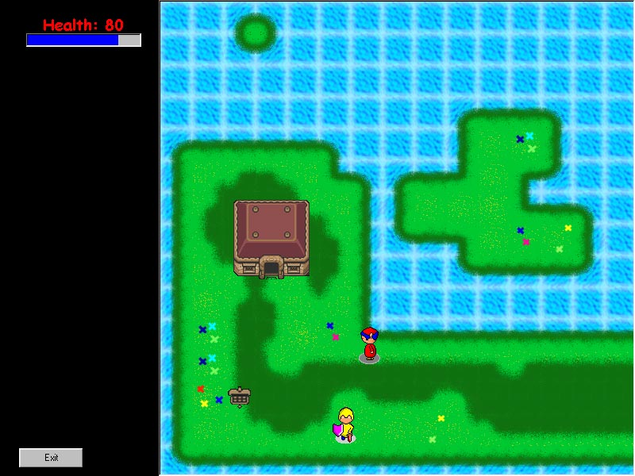



## A REALLY COOL GAME ENGINE \(big update\) \- see screenshot

### Description

THIS IS A BIG UPDATE ON MY OLD SUBMISSION

This is a game engine for you to learn from. My concept is very simple and extremely powerful code. I have taken the time to write a tutorial discribing my code in great detail to help learners easier understand. This is an update of my old popular submission, I started work on it again after a small games company wanted me to work for them. I spent like 4 or 5 straight hours to implement multi-layer tile engine instead of single layer of tiles and magic into this game. You can see this where you see a house, sign posts, or treasure chests in the game. I stole the graphics from Zelda and implemented the code to allow two layers of tiles along with the ability to read signs in the game. Read the readme.txt and for instructions. Along with multi-layer tiles I finished the basic magic casting part for my game. All my code is written so it can EASILY be modified to fit an almost infinite array of tiles and magic spells. All you have to do is understand my logic (which is pretty simple) and you can start making your own graphics and spells to add into the game. It's basically just changing a few numbers to make it work. Again, this isn't complete. I have stopped work on it after I implemented those 2 major features because I got lazy. I made this like 2 years ago and updated the code about 5 months ago in a few hours. I would appreciate high votes on this submission to help me get the "code of the month" =). I stopped programming since school ended but maybe I will start once college picks up, I got no motivation. I suggest you download this and learn from it, I believe this code and logic is really good (not to brag). For someone who is trying to make a game like this, it will open your eyes to many new concepts that would optimize your code and make your life easier. Well, just enjoy this.
 
### More Info
 

             |
---                |---
**Submitted On**   |2001-09-06 00:42:34
**By**             |[Haig Demerdjian](https://github.com/Planet-Source-Code/PSCIndex/blob/master/ByAuthor/haig-demerdjian.md)
**Level**          |Advanced
**User Rating**    |4.2 (71 globes from 17 users)
**Compatibility**  |VB 5\.0, VB 6\.0
**Category**       |[Games](https://github.com/Planet-Source-Code/PSCIndex/blob/master/ByCategory/games__1-38.md)
**World**          |[Visual Basic](https://github.com/Planet-Source-Code/PSCIndex/blob/master/ByWorld/visual-basic.md)
**Archive File**   |[A REALLY C25994962001\.zip](https://github.com/Planet-Source-Code/haig-demerdjian-a-really-cool-game-engine-big-update-see-screenshot__1-27012/archive/master.zip)

